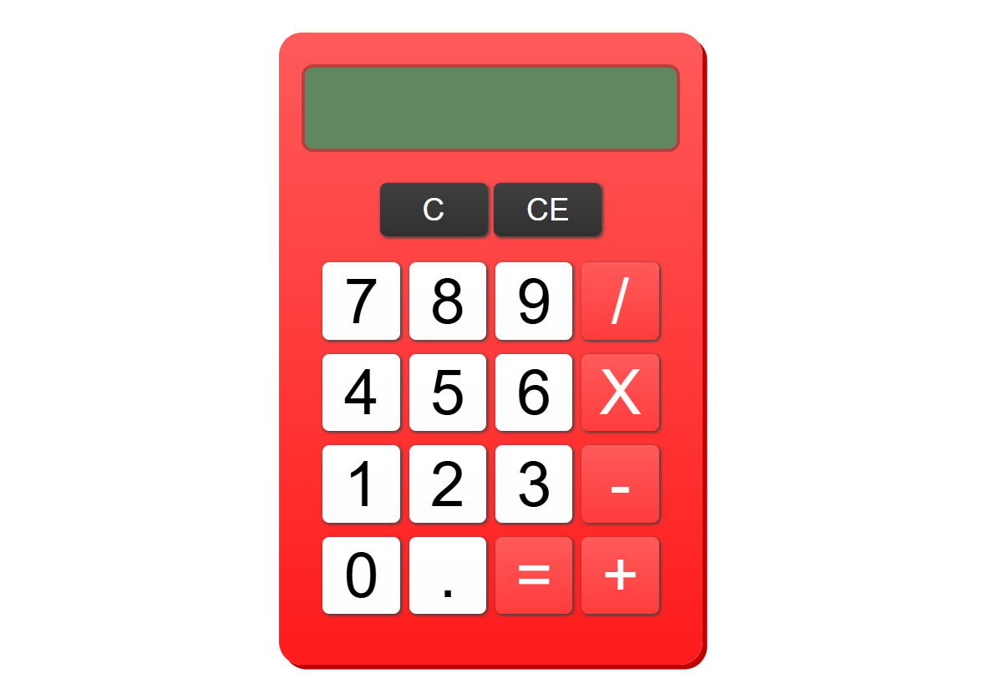

# Calculator

	

## Descrição

Este projeto é uma calculadora simples desenvolvida com HTML, CSS e JavaScript. A interface permite inserir números, escolher operações matemáticas básicas e visualizar o resultado diretamente no visor.

As operações disponíveis são:

- soma
- subtração
- multiplicação
- divisão

## Como a lógica funciona

A lógica da calculadora é centralizada no arquivo `script.js` e funciona a partir de eventos de clique nos botões.

### 1. Captura dos botões

Um evento é registrado no contêiner que agrupa os botões. Sempre que um botão é clicado, o código identifica seu conteúdo e sua classe para decidir qual tipo de ação deve ser executada.

### 2. Separação por tipo de ação

Cada botão é tratado por uma função específica:

- números são enviados para a função que monta o valor atual no visor
- operadores armazenam a operação escolhida
- botões especiais tratam ações como limpar, apagar a entrada atual e calcular o resultado

Essa separação deixa o comportamento da calculadora mais organizado e fácil de manter.

### 3. Armazenamento temporário dos valores

O projeto usa um array chamado `cache` para guardar os dados necessários durante o cálculo. Nele ficam armazenados:

- o primeiro número
- o operador
- o segundo número

Quando esses três elementos estão disponíveis e uma nova operação ou o botão `=` é acionado, a função `operate` executa o cálculo correspondente.

### 4. Execução das operações

A função `operate(num1, num2, operator)` recebe dois números e o operador matemático. Com base no operador informado, ela retorna o resultado da conta.

Isso evita repetir a lógica das operações em diferentes partes do código e concentra esse comportamento em um único ponto.

### 5. Atualização do visor

O visor é atualizado sempre que:

- um número é digitado
- uma operação intermediária é concluída
- o resultado final é calculado
- o usuário limpa ou apaga valores

Também existe um controle para evitar entradas inválidas, como inserir mais de um ponto decimal no mesmo número, e para limitar a quantidade de caracteres exibidos no visor.

## Objetivo

Este projeto foi criado como exercício prático para reforçar conceitos fundamentais de manipulação do DOM, tratamento de eventos, organização de lógica em funções e controle de estado com JavaScript.

## Créditos
Este projeto foi desenvolvido como parte dos exercícios e estudos do [The Odin Project](https://www.theodinproject.com/).
